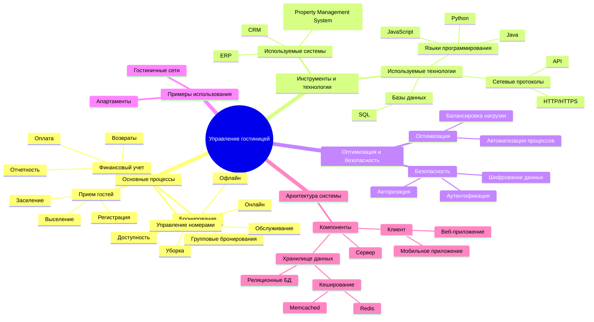

```mermaid
mindmap
  root((Управление гостиницей))
    Основные процессы
      Бронирование
        Онлайн
        Офлайн
        Групповые бронирования
      Прием гостей
        Регистрация
        Заселение
        Выселение
      Управление номерами
        Доступность
        Уборка
        Обслуживание
      Финансовый учет
        Оплата
        Возвраты
        Отчетность
    Инструменты и технологии
      Используемые системы
        PMS (Property Management System)
        CRM
        ERP
      Используемые технологии
        Базы данных
          SQL
        Языки программирования
          Python
          JavaScript
          Java
        Сетевые протоколы
          HTTP/HTTPS
          API
    Оптимизация и безопасность
      Оптимизация
        Автоматизация процессов
        Балансировка нагрузки
      Безопасность
        Шифрование данных
        Аутентификация
        Авторизация
    Примеры использования
      Гостиничные сети
      Апартаменты
    Архитектура системы
      Компоненты
        Клиент
          Веб-приложение
          Мобильное приложение
        Сервер
        Хранилище данных
          Реляционные БД
          Кеширование
            Redis
            Memcached
```
