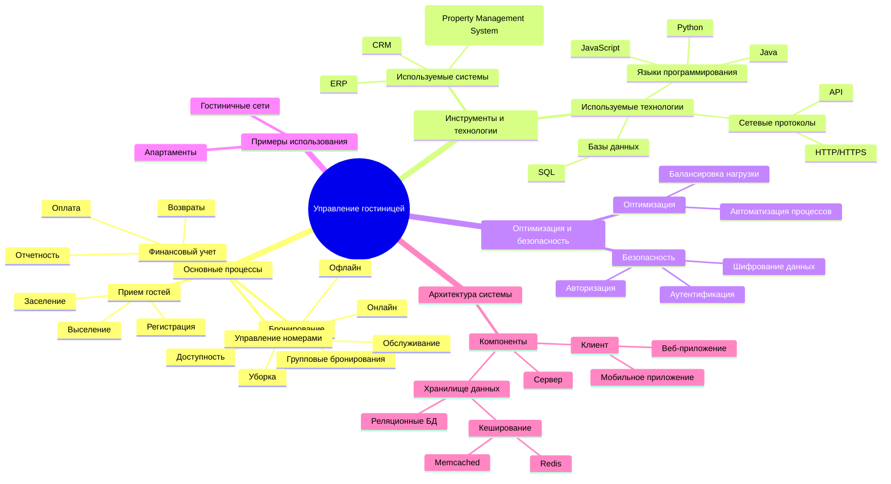
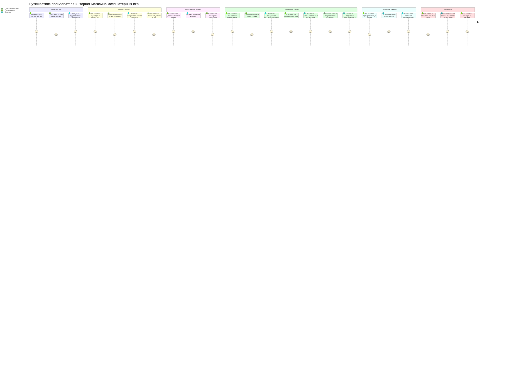

# Структура функциональных возможностей (Mind Map)

```mermaid
mindmap
  root((Управление гостиницей))
    Основные процессы
      Бронирование
        Онлайн
        Офлайн
        Групповые бронирования
      Прием гостей
        Регистрация
        Заселение
        Выселение
      Управление номерами
        Доступность
        Уборка
        Обслуживание
      Финансовый учет
        Оплата
        Возвраты
        Отчетность
    Инструменты и технологии
      Используемые системы
        PMS (Property Management System)
        CRM
        ERP
      Используемые технологии
        Базы данных
          SQL
        Языки программирования
          Python
          JavaScript
          Java
        Сетевые протоколы
          HTTP/HTTPS
          API
    Оптимизация и безопасность
      Оптимизация
        Автоматизация процессов
        Балансировка нагрузки
      Безопасность
        Шифрование данных
        Аутентификация
        Авторизация
    Примеры использования
      Гостиничные сети
      Апартаменты
    Архитектура системы
      Компоненты
        Клиент
          Веб-приложение
          Мобильное приложение
        Сервер
        Хранилище данных
          Реляционные БД
          Кеширование
            Redis
            Memcached
```

# Диаграмма путешествия пользователя (User Journey Diagram)

```mermaid
journey
    title Путешествие пользователя интернет-магазина компьютерных игр
    section Регистрация
      Пользователь заходит на сайт: 5: Пользователь
      Заполняет форму регистрации: 4: Пользователь
      Получает подтверждение регистрации: 5: Система
    section Просмотр каталога
      Пользователь переходит в каталог игр: 5: Пользователь
      Выбирает фильтры или сортировку: 4: Пользователь
      Система отображает игры по заданным параметрам: 5: Система
      Пользователь открывает детали игры: 4: Пользователь
    section Добавление в корзину
      Пользователь добавляет игру в корзину: 5: Пользователь
      Система обновляет корзину: 5: Система
      Пользователь проверяет содержимое корзины: 4: Пользователь
    section Оформление заказа
      Пользователь переходит к оформлению заказа: 5: Пользователь
      Заполняет данные для доставки: 4: Пользователь
      Система отображает итоговую стоимость: 5: Система
      Пользователь подтверждает заказ: 5: Пользователь
      Система отправляет данные в платёжную систему: 5: Система
      Платёжная система подтверждает успешную транзакцию: 5: Платёжная система
      Система уведомляет пользователя о принятии заказа: 5: Система
    section Управление заказом
      Пользователь проверяет статус заказа: 4: Пользователь
      Система обновляет статус заказа: 5: Система
      Пользователь получает уведомление о доставке: 5: Система
    section Завершение
      Пользователь оставляет отзыв на игру: 4: Пользователь
      Система сохраняет отзыв и обновляет рейтинг игры: 5: Система
      Пользователь выходит из системы: 5: Пользователь
```
